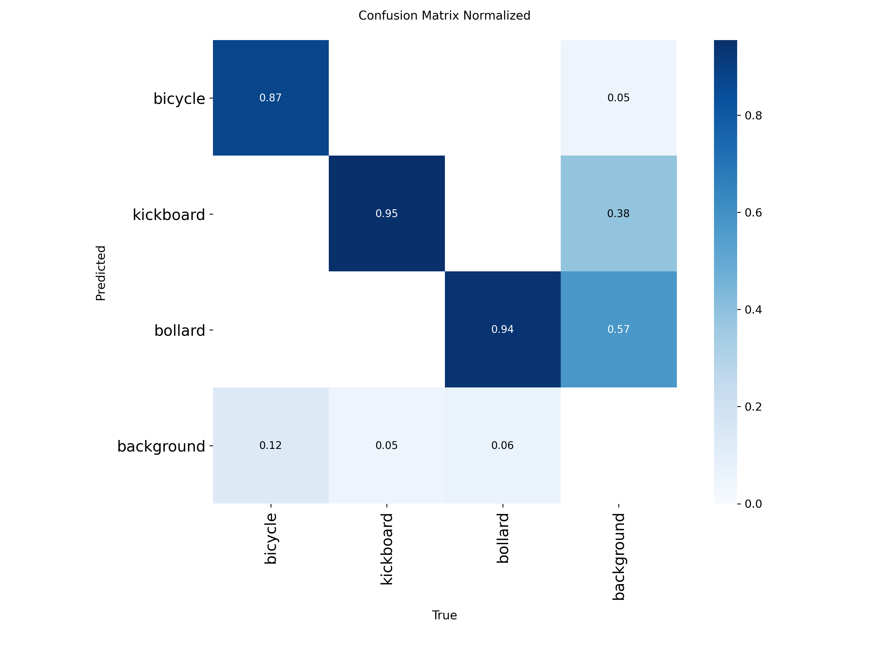

교통약자를 위한 AI 음성 보행 내비게이션

## 데이터셋

| Source | Images | Classes | License |
|--------|--------|---------|---------|
| [bicycle (Dng)](https://universe.roboflow.com/dng-cjryd/bicycle-i7nhz) | 127 | Bicycle | CC BY 4.0 |
| [kickboard (Inha Univ)](https://universe.roboflow.com/inha-univ-vgzgz/kickboard-ibhkj) | 462 | kb | CC BY 4.0 |
| [bollard (project-60htx)](https://universe.roboflow.com/project-60htx/bollard-v2gn5) | 634 | bollad1, bollard, bollard_abnormal, bollard_normal, tubular marker_normal | CC BY 4.0 |
| **Total** | **1,223** | → **3 unified classes** | |

### Unified Classes

| ID | Class | Description |
|----|-------|-------------|
| 0 | bicycle | 자전거 |
| 1 | kickboard | 전동킥보드 |
| 2 | bollard | 볼라드 (5개 서브클래스 통합) |

---

## Quick Start

### 1. 환경 설정

```bash
pip install roboflow albumentations opencv-python-headless ultralytics
```

### 2. 데이터 다운로드

```bash
python scripts/data_pipeline.py download --api-key YOUR_ROBOFLOW_API_KEY
```

> Roboflow API key: https://app.roboflow.com/settings/api 에서 발급

### 3. 전체 파이프라인 실행 (merge → split → validate)

```bash
python scripts/data_pipeline.py all
```

### 4. 클래스 밸런싱 (bicycle 증강)

```bash
python scripts/augmentation.py --target-per-class 500
```

### 5. YOLO 학습 (Phase 2)

```bash
scripts/train.py 참고바람
```

---

## 프로젝트 구조

```
safewalk-nav/
├── configs/
│   └── dataset.yaml              # YOLO 설정 (3 classes)
├── scripts/
│   ├── data_pipeline.py          # 다운로드/리매핑/분할/검증
│   └── augmentation.py           # 클래스 밸런싱 증강
├── data/
│   ├── raw/                      # Roboflow 원본
│   │   ├── bicycle/
│   │   ├── kickboard/
│   │   └── bollard/
│   ├── merged/                   # 리매핑 후 통합
│   └── processed/                # 최종 train/val/test
│       ├── images/{train,val,test}/
│       └── labels/{train,val,test}/
└── models/                       # 학습된 weights
```

---

## 추론 결과

### Evaluation Results

mAP@0.5:      0.9274
 
mAP@0.5:0.95: 0.7064

Per-class AP@0.5:

bicycle      0.8802

kickboard    0.9540

bollard      0.9482



## 개별 명령어

```bash
# 데이터셋 다운로드
python scripts/data_pipeline.py download --api-key YOUR_KEY

# 클래스 리매핑 + 통합
python scripts/data_pipeline.py merge

# Train/Val/Test 분할 (7:2:1)
python scripts/data_pipeline.py split --ratios 0.7,0.2,0.1 --seed 42

# 데이터 검증 + 통계
python scripts/data_pipeline.py validate

# 부족 클래스 자동 증강
python scripts/augmentation.py --target-per-class 500

# 특정 클래스만 증강
python scripts/augmentation.py --classes 0 --multiply 4
```

## Flutter & Server 아키텍처

## 1. 시스템 개요 (System Overview)

본 시스템은 **저지연(Low-Latency)** 실시간 분석을 목표로 합니다. 모바일 클라이언트에서 수집된 영상 프레임을 서버로 스트리밍하고, AI 분석 결과를 즉각적인 음성 피드백으로 전환하는 **Request-Response Stream** 구조를 가집니다.

## 2. 아키텍처 다이어그램 (Architecture Diagram)

```mermaid
graph TD
    %% 클라이언트 영역
    subgraph Client ["📱 Flutter Client (App)"]
        direction TB
        Cam[📷 Camera Layer] --> Cap[🖼️ Frame Capture]
        Cap -->|200ms Interval| WS_C[🔌 WebSocket Client]
        
        subgraph Logic ["⚙️ Mobile Logic"]
            WS_C -->|Receive JSON| Sync[🔄 Result Sync]
            Sync --> TTS[🗣️ TTS Engine]
            Sync --> UI[🎨 Overlay UI]
        end
    end

    %% 네트워크 계층
    WS_C <==>|Binary Frames / Analysis JSON| Network{🌐 WebSocket}

    %% 서버 영역
    subgraph Server ["🖥️ AI Server (FastAPI)"]
        direction TB
        WS_S[📩 WebSocket Server] --> Decoder[🖼️ OpenCV Decoder]
        
        subgraph AI_Engines ["🧠 Parallel Inference"]
            YOLO[🔍 YOLOv10: Obstacles]
            Pose[🧘 Mediapipe: Pose/Fall]
        end
        
        Decoder --> YOLO
        Decoder --> Pose
        
        YOLO -->|Objects| Risk[⚖️ Risk Analyzer]
        Pose -->|Pose Info| Risk
        
        Risk -->|RiskResult| WS_S
    end

    %% 스타일링
    style Client fill:#e1f5fe,stroke:#01579b
    style Server fill:#f3e5f5,stroke:#4a148c
    style AI_Engines fill:#fff3e0,stroke:#e65100,stroke-dasharray: 5 5
