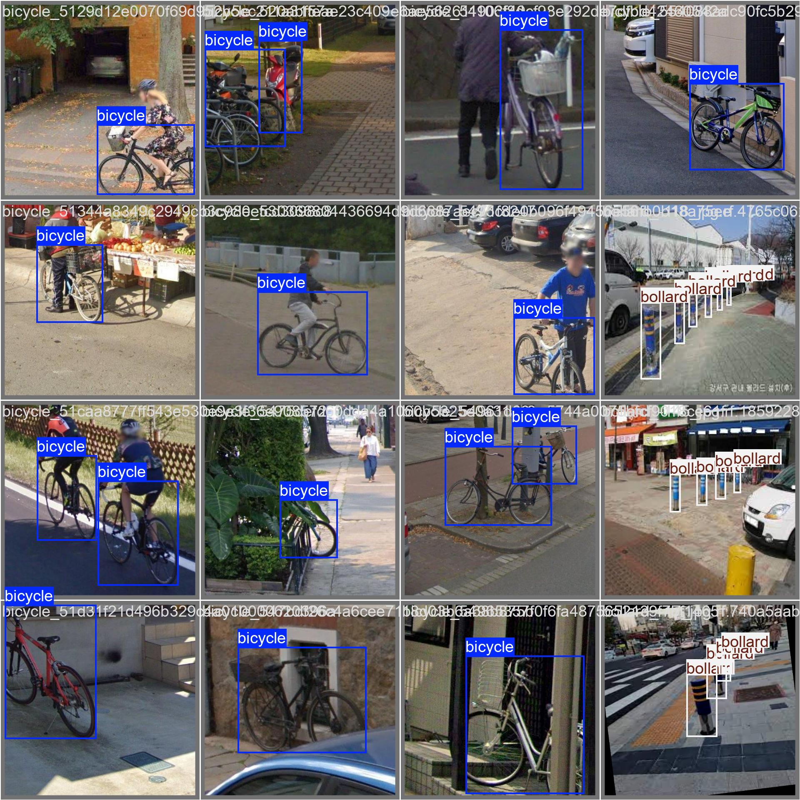
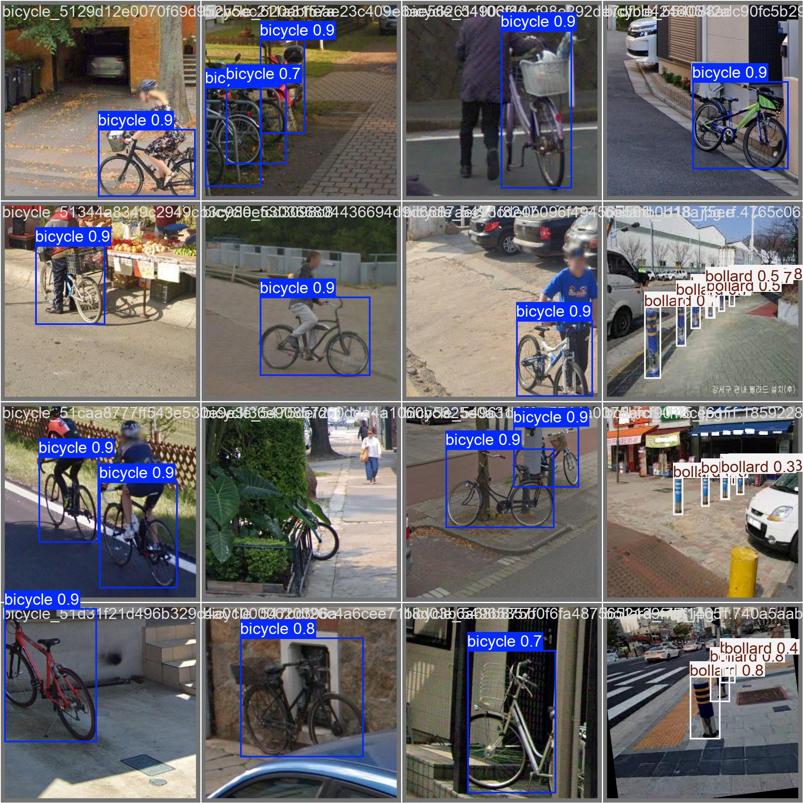

# 교통약자를 위한 AI 음성 보행 내비게이션

AI-based Voice Navigation System for Mobility Assistance

---

## Overview

SafeWalk Navigation은 교통약자를 위한 실시간 AI 보행 보조 시스템이다.  
모바일 카메라 입력을 기반으로 주변 장애물을 탐지하고, 이를 음성으로 안내하여 안전한 이동을 지원한다.

본 시스템은 저지연 스트리밍 구조와 멀티 AI 추론 파이프라인을 기반으로 설계되었다.

> Low-latency streaming + Multi-AI inference 기반의 실시간 보행 안전 시스템

---

## Dataset

### Sources

| Source | Images | Classes | License |
|--------|--------|---------|---------|
| [bicycle (Dng)](https://universe.roboflow.com/dng-cjryd/bicycle-i7nhz) | 127 | Bicycle | CC BY 4.0 |
| [kickboard (Inha Univ)](https://universe.roboflow.com/inha-univ-vgzgz/kickboard-ibhkj) | 462 | kb | CC BY 4.0 |
| [bollard (project-60htx)](https://universe.roboflow.com/project-60htx/bollard-v2gn5) | 634 | 5 subclasses | CC BY 4.0 |
| **Total** | **1,223** | **→ 3 Unified Classes** | |

---

### Unified Classes

| ID | Class | Description |
|----|-------|-------------|
| 0 | bicycle | 자전거 |
| 1 | kickboard | 전동 킥보드 |
| 2 | bollard | 볼라드 (5개 서브 클래스 통합) |

---

## Quick Start

### Installation

```bash
pip install roboflow albumentations opencv-python-headless ultralytics
````

---

### Download Dataset

```bash
python scripts/data_pipeline.py download --api-key YOUR_ROBOFLOW_API_KEY
```

Roboflow API Key:
[https://app.roboflow.com/settings/api](https://app.roboflow.com/settings/api)

---

### Run Full Pipeline

```bash
python scripts/data_pipeline.py all
```

**Pipeline Steps**

* Download
* Class Remapping
* Dataset Merge
* Train / Validation / Test Split
* Data Validation

---

### Data Augmentation

```bash
python scripts/augmentation.py --target-per-class 500
```

```bash
python scripts/augmentation.py --classes 0 --multiply 4
```

---

### Training

```bash
scripts/train.py
```

---

## Project Structure

```bash
safewalk-nav/
├── configs/
│   └── dataset.yaml
├── scripts/
│   ├── data_pipeline.py
│   └── augmentation.py
├── data/
│   ├── raw/
│   ├── merged/
│   └── processed/
│       ├── images/{train,val,test}
│       └── labels/{train,val,test}
└── models/
```

---

## Model Performance

### Evaluation Metrics

| Metric       | Score  |
| ------------ | ------ |
| mAP@0.5      | 0.9274 |
| mAP@0.5:0.95 | 0.7064 |

---

### Per-Class Performance

| Class     | AP@0.5 |
| --------- | ------ |
| bicycle   | 0.8802 |
| kickboard | 0.9540 |
| bollard   | 0.9482 |

---

### Confusion Matrix

<p align="center">
  
</p>

### 테스트 결과

<p align="center">
  
</p>

<p align="center">
  
</p>

---

## CLI Commands

```bash
# Download dataset
python scripts/data_pipeline.py download --api-key YOUR_KEY

# Merge datasets
python scripts/data_pipeline.py merge

# Split dataset (7:2:1)
python scripts/data_pipeline.py split --ratios 0.7,0.2,0.1 --seed 42

# Validate dataset
python scripts/data_pipeline.py validate

# Auto augmentation
python scripts/augmentation.py --target-per-class 500

# Class-specific augmentation
python scripts/augmentation.py --classes 0 --multiply 4
```

---

## System Architecture

### Real-Time Data Flow

| Step | Location    | Action                           | Data Type         |
| ---- | ----------- | -------------------------------- | ----------------- |
| 1    | Flutter App | Frame Capture (5 FPS)            | Raw Frame         |
| 2    | Network     | WebSocket Streaming              | Binary (JPEG)     |
| 3    | AI Server   | Decode Frame                     | NumPy Array       |
| 4    | AI Server   | Parallel Inference (YOLO + Pose) | Inference Results |
| 5    | AI Server   | Risk Analysis                    | JSON              |
| 6    | Flutter App | TTS + UI Rendering               | Voice / UI        |

---

## Components

### Flutter Client

* Camera Module: 5 FPS 프레임 캡처
* WebSocket Service: 실시간 데이터 송수신
* TTS Engine: 위험 메시지 음성 변환
* Overlay UI: 실시간 시각화

---

### AI Server

* FastAPI: 비동기 처리 서버
* YOLOv10: 객체 탐지
* Mediapipe: 자세 분석
* Risk Analyzer: 위험도 계산

---

## Risk Scoring

위험 점수는 객체 거리, 객체 가중치, 사용자 자세를 기반으로 계산된다.

* **D (Distance)**: 객체 면적 비율 기반 거리 추정
* **W (Weight)**: 객체 위험도 가중치
* **P (Posture)**: 사용자 자세 안정성

---

## Risk Levels

| Level    | Score Range | Interval  | Description |
| -------- | ----------- | --------- | ----------- |
| Safe     | 0.0 – 0.3   | 5s        | 전방 안전       |
| Caution  | 0.3 – 0.6   | 3s        | 장애물 존재      |
| Danger   | 0.6 – 0.85  | 1.5s      | 접근 위험       |
| Critical | 0.85 – 1.0  | Immediate | 즉시 정지       |

---

## Design Highlights

* Low Latency Streaming (≈200ms)
* Parallel AI Inference
* Mobile–Server Architecture
* Real-time Voice Feedback

---

## Future Work

* Depth Estimation 기반 거리 정확도 개선
* On-device Inference (TensorRT / CoreML)
* 사용자 맞춤 위험도 시스템
* GPS 기반 내비게이션 통합

---

## License

This project uses datasets under CC BY 4.0 license.
